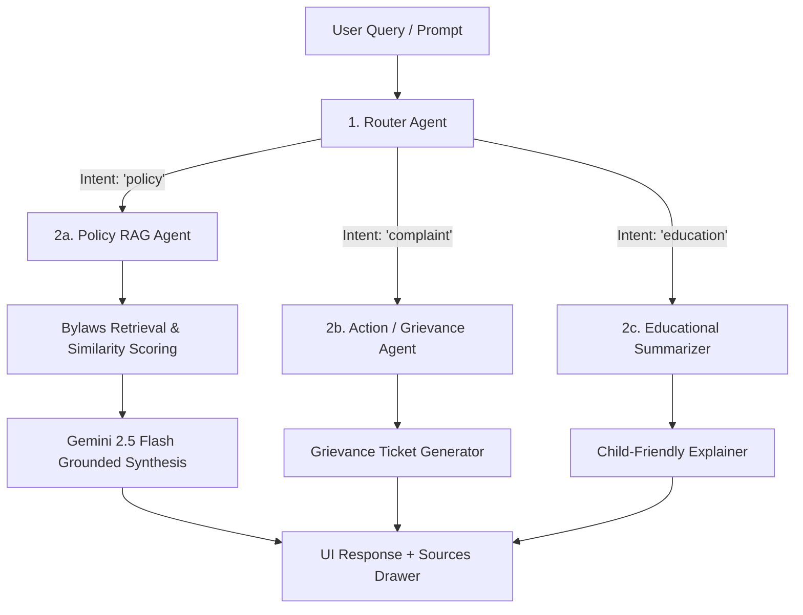
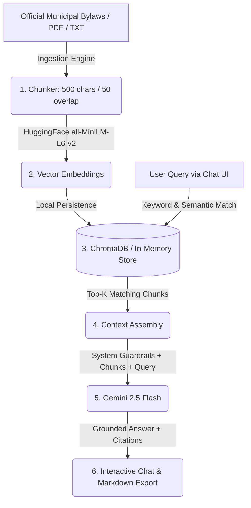

# EcoPolicy RAG 🌿🤖
### Municipal Sustainability & Waste Management Bylaw Intelligence

[](https://www.python.org/)
[](https://nodejs.org/)
[](https://vitejs.dev/)
[](https://fastapi.tiangolo.com/)
[](https://www.trychroma.com/)
[](https://ai.google.dev/)
[](https://render.com/)
[](https://opensource.org/licenses/MIT)

---

## 🌟 Overview

**EcoPolicy RAG** is an AI-powered, multi-agent Retrieval-Augmented Generation (RAG) platform tailored for municipal waste management, environmental regulations, and urban sustainability bylaws. 

Traditional generic LLMs frequently hallucinate legal penalties or misstate disposal bylaws. EcoPolicy RAG grounds all responses strictly in official municipal policy documents with exact clause citations, source similarity metrics, and responsible AI guardrails.

---

## 🤖 Multi-Agent Architecture

EcoPolicy RAG features an intelligent **Intent Router Agent** that analyzes user queries and dynamically routes them to specialized agents:

| Agent | Intent Detected | Role & Behavior |
| :--- | :--- | :--- |
| 📜 **Policy Agent** | `policy` | Full RAG pipeline — searches municipal bylaws corpus, retrieves top-k chunks, and synthesizes grounded answers with clause citations. |
| 📋 **Action / Grievance Agent** | `complaint` | Identifies violations or reports (e.g. illegal dumping, missed pickup) and auto-drafts a formal municipal grievance ticket with a tracking ID and next steps. |
| 🧒 **Education Agent** | `education` | Translates dense regulatory language into engaging, child-friendly explanations with emojis for schools and public awareness. |



---

## ✨ Key Features & Highlights

- **Multi-Agent Intent Routing**: Intelligently switches between regulatory policy retrieval, civic complaint ticketing, and educational explanations.
- **Strict Grounding & Guardrails**: Prevents hallucinations by relying on verified municipal policy text; triggers responsible refusal when answers are not present in the corpus.
- **Full Traceability & Citations**: Inspect exact source clauses, document titles, and similarity confidence scores for every answer.
- **Interactive Bylaw Library & Ingestion**: Browse active municipal bylaws by category or ingest new sustainability bylaws with dynamic chunking.
- **Vector Store Inspector**: Real-time observability into indexed document counts, chunk statistics, embedding dimensions (384-dim), and store status.
- **Rich Markdown Chat & Export**: Inline formatting for clauses, code, and lists, with one-click copy and Markdown chat export.
- **Dual Backend Architecture**:
  - **Fullstack Express + Vite Server**: Unified, zero-configuration development and production server with `tsx watch` hot-reloading.
  - **Python FastAPI Microservice**: Standalone backend with ChromaDB vector store, HuggingFace embeddings (`all-MiniLM-L6-v2`), API key authentication, and rate limiting via `slowapi`.
- **Cloud Deployment Ready**: Includes native Render Blueprint (`render.yaml`).

---

## 📊 End-to-End RAG Architecture



---

## 🚀 Setup & Installation Instructions

### Prerequisites
- **Node.js**: v18.0.0 or higher
- **npm**: v9.0.0 or higher
- **Python**: v3.10 or higher (for FastAPI backend and evaluation scripts)
- **Google Gemini API Key**: [Get an API Key here](https://aistudio.google.com/)

---

### Step 1: Clone the Repository

```bash
git clone https://github.com/Yashendra-org/EcoPolicy-RAG-an-AI-powered-Municipal-Waste-Sustainability-Policy-Assistant.git
cd EcoPolicy-RAG-an-AI-powered-Municipal-Waste-Sustainability-Policy-Assistant
```

---

### Step 2: Configure Environment Variables

Create a `.env` file in the project root:

```env
# Google Gemini API Key for LLM synthesis and intent routing
GEMINI_API_KEY="your_gemini_api_key_here"

# (Optional) Secret key for the FastAPI service
API_SECRET_KEY="ECO_RAG_SECURE_KEY_2026"
```

> **Note**: If `GEMINI_API_KEY` is not provided, the system seamlessly operates in **grounded fallback mode**, extracting exact excerpts from the top-matching municipal bylaws without crashing.

---

### Step 3: Install Node Dependencies & Run Frontend/Express App

```bash
# Install Node dependencies
npm install

# Start development server with automatic server reload (tsx watch + Vite HMR)
npm run dev
```

Open [http://localhost:3000](http://localhost:3000) in your browser.

---

### Step 4 (Optional): Install Python Dependencies & Run FastAPI Backend

If you want to run the standalone Python FastAPI RAG service or run evaluation benchmarks:

```bash
# Create and activate a Python virtual environment
python -m venv venv

# On Windows:
.\venv\Scripts\activate
# On Linux / macOS:
source venv/bin/activate

# Install Python requirements
pip install -r requirements.txt

# Start the FastAPI server on port 8000
uvicorn main:app --reload --port 8000

# Run automated RAG evaluation benchmark
python eval.py
```

---

## 🛠 Available Scripts

| Command | Description |
| :--- | :--- |
| `npm run dev` | Starts Express server + Vite client with hot reload (`tsx watch server.ts`) on `http://localhost:3000` |
| `npm run build` | Builds Vite production bundle and bundles `server.ts` into `dist/server.cjs` |
| `npm run start` | Runs the production bundle (`node dist/server.cjs`) |
| `npm run lint` | Runs TypeScript typecheck (`tsc --noEmit`) |
| `uvicorn main:app --reload` | Runs the Python FastAPI RAG microservice on `http://127.0.0.1:8000` |
| `python eval.py` | Runs the automated RAG evaluation benchmark suite |

---

## 🧪 Sample Queries to Test

### 📜 Policy Queries (Routed to Policy Agent)
- *"What are the rules for disposing of old laptop batteries and electronics?"*
- *"What is the fine for organic green bin contamination?"*
- *"How should commercial restaurants handle cooking oil and grease?"*
- *"What are the lawn watering schedules and restrictions?"*

### 📋 Grievances & Complaints (Routed to Action Agent)
- *"I want to report illegal dumping of construction debris in the park."*
- *"File a complaint about missed recycling pickup in Ward 4."*

### 🧒 Child-Friendly / Educational (Routed to Education Agent)
- *"Explain composting to a 10-year-old child."*
- *"Can you explain to kids why we shouldn't throw batteries in the trash?"*

---

## 📂 Project Structure

```text
EcoPolicy-RAG/
├── .bob/                       # IBM Bob AI engineer workflows & skills configuration
│   ├── AGENT.md                # Agent guidelines, multi-agent specs & test rules
│   └── skills/ecopolicy.md     # Architecture decisions, run commands, and conventions
├── data/
│   └── municipal_waste_bylaws.txt  # Municipal policy bylaws source dataset
├── src/
│   ├── components/
│   │   ├── ArchitectureView.tsx    # Interactive system architecture diagram
│   │   ├── ChatInterface.tsx       # Real-time multi-agent chat interface
│   │   ├── Header.tsx              # Application header & live stats
│   │   ├── IngestionModal.tsx      # Modal for custom bylaw ingestion
│   │   ├── PolicyLibrary.tsx       # Bylaw document browser with category filters
│   │   └── VectorInspector.tsx     # Vector store and embedding inspector
│   ├── data/
│   │   └── sampleBylaws.ts         # Seed municipal bylaws dataset
│   ├── App.tsx                     # Main React application shell & tab router
│   ├── index.css                   # Tailwind CSS styling & animations
│   ├── main.tsx                    # React DOM entrypoint
│   └── types.ts                    # Shared TypeScript interfaces
├── eval.py                     # Python RAG retrieval benchmark script
├── main.py                     # Standalone FastAPI RAG microservice with ChromaDB
├── municipal_waste_policy.txt  # Policy text corpus for FastAPI microservice
├── package.json                # Node dependencies, scripts, and build configuration
├── render.yaml                 # Render cloud deployment blueprint
├── requirements.txt            # Python dependencies (FastAPI, LangChain, ChromaDB)
├── server.ts                   # Express server, Multi-Agent router & RAG engine
├── tsconfig.json               # TypeScript configuration
└── vite.config.ts              # Vite configuration with Tailwind CSS plugin
```

---

## ☁️ Deployment on Render

This project includes a [render.yaml](file:///c:/Users/Yashendra%20kumar/vscode/Projects/EcoPolicy-RAG-an-AI-powered-Municipal-Waste-Sustainability-Policy-Assistant/render.yaml) blueprint for one-click deployment:

1. Connect your GitHub repository to [Render](https://render.com/).
2. Create a new **Web Service** from Blueprint.
3. Configure the environment variable:
   - `GEMINI_API_KEY`: Your Gemini API key.
4. Render will automatically build via `npm install && npm run build` and start with `npm start`.

---

## 📄 License

This project is licensed under the **MIT License**. See the [LICENSE](LICENSE) file for details.
