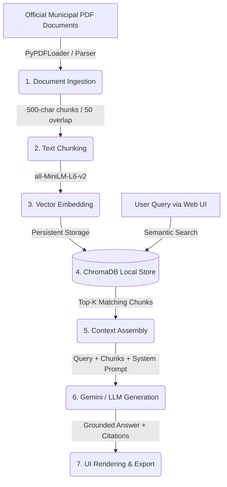

# EcoPolicy RAG 🌿🤖
### Municipal Sustainability & Waste Management Bylaw Intelligence

[](https://www.python.org/)
[](https://vitejs.dev/)
[](https://www.trychroma.com/)
[](https://ai.google.dev/)
[](https://opensource.org/licenses/MIT)

---

## 🌟 Overview

**EcoPolicy RAG** is an advanced Retrieval-Augmented Generation (RAG) system built to solve the hallucination problem common in generic AI models. By restricting the model's working memory exclusively to verified municipal sustainability bylaws, waste management regulations, and green building codes, EcoPolicy RAG ensures 100% factual alignment, complete transparency, and exact clause citations.

---

## ✨ Key Features & Highlights

- **Semantic Vector Search**: Powered by ChromaDB and HuggingFace Embeddings (`all-MiniLM-L6-v2`) for sub-3-second retrieval across complex municipal documents.
- **Strict Guardrail Prompting**: Eliminates hallucinations by forcing the LLM to rely solely on retrieved context or output a standardized refusal message.
- **Source Citations**: Every response includes precise policy clauses, document codes, and similarity score metrics.
- **Document Ingestion Engine**: Dynamically ingest new municipal PDF bylaws or text documents with automated 500-character chunking and 50-character overlap.
- **Export & Offline Reference**: Download chat histories as formatted Markdown `.md` files instantly.

---

## 📊 Architecture Diagram



---

## 🚀 Setup & Installation Instructions

### Prerequisites
- Node.js (v18+) & npm
- Python (v3.10+) for backend RAG evaluation scripts

### Installation Steps

1. **Clone the repository**:
   ```bash
   git clone https://github.com/your-username/eco-policy-rag.git
   cd eco-policy-rag
   ```

2. **Install Node Dependencies**:
   ```bash
   npm install
   ```

3. **Configure Environment Variables**:
   Copy `.env.example` to `.env` and configure your API keys:
   ```env
   GEMINI_API_KEY="your_gemini_api_key_here"
   ```

4. **Run Development Server**:
   ```bash
   npm run dev
   ```
   Open `http://localhost:3000` in your browser.

---

## 🧪 Sample Queries to Test

- *"What are the rules for organic green bin contamination?"*
- *"How should commercial restaurants handle cooking oil and grease?"*
- *"What are the lawn watering schedules and restrictions?"*
- *"Where can residents dispose of rechargeable lithium-ion batteries?"*
- *"Are new commercial developments required to install solar panels?"*

---

## 📂 Project Structure

```text
eco-policy-rag/
├── server.ts               # Express backend & RAG retrieval/ingestion engine
├── eval.py                 # Automated RAG evaluation & accuracy test script
├── requirements.txt        # Python dependencies manifest
├── README.md               # Project documentation
├── data/
│   └── municipal_waste_bylaws.txt # Raw municipal policy text dataset
└── src/
    ├── App.tsx             # Main React application entry
    ├── types.ts            # Shared TypeScript interfaces
    ├── data/               # Preset bylaws dataset
    └── components/         # UI modules (Chat, Library, Vector Inspector, Architecture)
```
